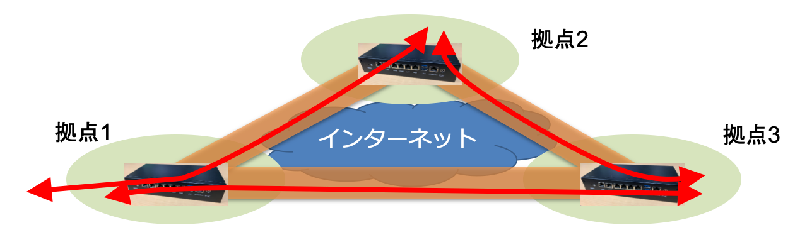

# ASANOシステム

ASANOシステムは、東京大学におけるキャンパスネットワークでの利用を念頭
に、東京大学 情報基盤センターで開発されたSD-WANのシステムです。ASANOシ
ステムは、離れた拠点に設置された複数のASANOデバイス間でオーバーレイネッ
トワークを構成し、任意のデバイス間でVLANを延伸することができます。

{ width=500px }

現在の大学のキャンパスは、いくつかのメインキャンパスや、遠隔研究拠点な
ど、複数の拠点を持つ場合が多くあります。キャンパスネットワークは、こう
した地理的に分散した複数の拠点へと延伸されなければなりません。

また、ひとつの組織が複数のキャンパスにまたがっている場合や、ある研究リ
ソースにアクセスできる限られたセグメントを複数の拠点の研究者が使いたい
など、結果的にVLANを多拠点にわたって伸ばすケースが多々あります。

さらに遠隔地の研究拠点では、インターネット越しに、キャンパスネットワー
クのVLANを延伸しなければなりません。このとき、VLANを伸ばすと同時に、
NAT越えや、通信の暗号化を行う必要があります。

{ width=500px }

ASANOシステムでは、そうした遠隔研究施設やVLANを伸ばしたい建物、居室な
どにASANOデバイスを設置し、ASANOデバイス間で自動で構成されるマルチポイ
ントのオーバーレイネットワークを使って、セキュリティを保ちながらVLANを
延伸することができます。

各ASANOデバイスは、オーケストレータによって集中管理されます。ASANOデバ
イス自身に保存されている設定は、自身のbootに必要な情報、そしてオーケス
トレータに接続するための情報のみです。それ以外の、例えばどのポートにど
のVLANを出すか、といった設定は全てオーケストレータ上に存在します。この
ように複数のASANOデバイスのVLANなどの設定を一元管理することで、設定変
更などの日々の運用を簡単に行うことができます。

また、ASANOシステムのオーバーレイは、内部的に[Virtual eXtensible LAN
(VXLAN)](https://tools.ietf.org/html/rfc7348)も用いているため、VLANの
限界である4000個以上のセグメントの作成や、管理上プライベートなVLAN番号
を使っているセグメントでも、ひとつのASANOシステム上で他の組織のセグメ
ントと一緒に延伸することができます。

### 技術移転について

2020年10月、ASANOシステムのライセンス契約を日本ラッド株式会社と締結し、
商用版のASANOシステムの発売が決まりました。

- [東京大学 情報基盤センターのニュースページ](https://www.itc.u-tokyo.ac.jp/blog/2020/10/06/post-2698/)
- [日本ラッド株式会社プレスリリース](https://www.nippon-rad.co.jp/ir/release/data/20201006.pdf) (PDF)

### 主な関連論文

-  中村　遼, 関谷勇司, 工藤知宏,“オープンソースソフトウェアを用いたキャンパスSD-WANの検討”, 電子情報通信学会, 信学技報, vol. 117, no.354, IA2017-64, pp. 67--72

